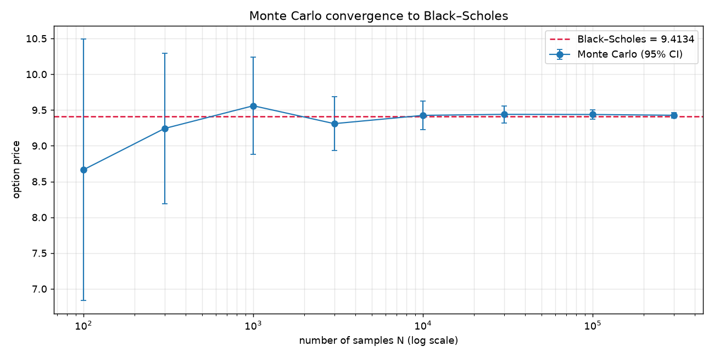
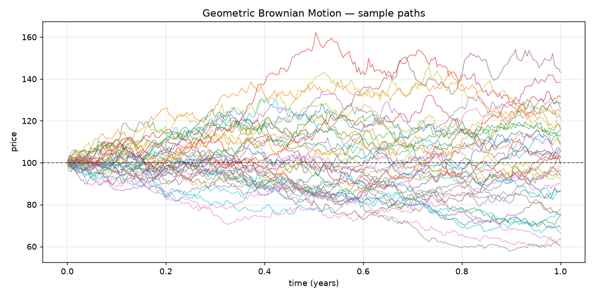

# monte-carlo

**蒙特卡洛模拟与可视化** — GBM 路径、欧式期权定价、收敛性与方差缩减。
*A Monte Carlo toolkit: GBM paths, option pricing, convergence & variance reduction.*

[](https://github.com/dachuancc/monte-carlo/actions/workflows/ci.yml)

核心演示一件事：**用随机模拟逼近 Black–Scholes 解析解**，并用**标准误**量化"逼近得有多好"——
这是蒙特卡洛方法里最重要、也最容易被忽略的部分。

## 特点

- **精确模拟 GBM**：直接采样解析解 $S_t = S_0 e^{(r-\sigma^2/2)t + \sigma W_t}$，**无离散化偏差**。
- **Black–Scholes 解析解**：纯标准库实现（正态 CDF 用 `erf`），**不依赖 scipy**。
- **量化不确定度**：每次定价都给出标准误与 95% 置信区间，而不是只丢一个数字。
- **方差缩减**：内置**对偶变量法**，标准误降低约 25%。
- **收敛性研究**：验证 $\mathrm{SE} \propto 1/\sqrt{N}$ 这一根本约束。
- **23 个单元测试 + CI**：数值正确性（对拍解析解）、平价关系、方差缩减都有守护。

## 快速开始

```bash
uv sync

# 给平值看涨期权定价（20 万条路径），并与 Black–Scholes 对拍
uv run monte-carlo price --kind call --n 200000

# 收敛性研究，并导出收敛图
uv run monte-carlo convergence --n-max 300000 --plot docs/convergence.png

# 模拟并绘制 GBM 路径
uv run monte-carlo paths --n-paths 200 --plot docs/paths.png

uv run pytest
```

## 结果示例

默认参数 $S_0=100,\ K=100,\ r=3\%,\ \sigma=20\%,\ T=1$，Black–Scholes 解析解 **9.413403**：

| N | MC 价格 | 标准误 | 误差 | 误差/SE |
|---:|---:|---:|---:|---:|
| 100 | 7.238192 | 0.747250 | −2.175211 | 2.91 |
| 300 | 8.043061 | 0.499792 | −1.370343 | 2.74 |
| 1,000 | 8.975190 | 0.316655 | −0.438213 | 1.38 |
| 3,000 | 9.347864 | 0.194515 | −0.065539 | 0.34 |
| 10,000 | 9.369149 | 0.106067 | −0.044254 | 0.42 |
| 30,000 | 9.423853 | 0.061469 | +0.010450 | 0.17 |
| 100,000 | 9.427980 | 0.033451 | +0.014577 | 0.44 |

**注意最后一列**：误差始终落在标准误的几倍之内——说明标准误确实刻画了估计的不确定度。
而标准误大约每 10 倍样本量降为 1/3.2（$\approx\sqrt{10}$），印证 $\mathrm{SE} \propto 1/\sqrt{N}$。



### 方差缩减（对偶变量法）

| 方法 | 价格 | 标准误 | 方差缩减 |
|---|---|---|---|
| 朴素 MC | 9.362991 | 0.031478 | — |
| 对偶变量法 | 9.374835 | 0.023448 | **25.5%** |



> ⚠️ 以上均为**合成模拟**结果，参数为教科书示例，仅用于演示方法的正确性。

## 数学要点

- **风险中性定价**：模拟漂移必须取无风险利率 $r$（而非真实收益率 $\mu$）；
  贴现因子 $e^{-rT}$。
- **精确模拟优于 Euler 离散**：GBM 有解析解，直接采样即可，没有离散化误差。
- **对偶变量法的标准误要算对**：对每对 $(Z, -Z)$ 的收益**先取平均**得到 i.i.d. 样本，
  再计算标准误；若把 $2N$ 个相关样本当作独立样本，会**低估**标准误。
- **收敛速度**：$\mathrm{SE} \propto N^{-1/2}$——降一个数量级的误差需要 100 倍样本量。

## 与 quant-notes 的关系

本仓库是 [`quant-notes`](https://github.com/dachuancc/quant-notes) 中
「随机过程 / 期权定价」章节的**可执行实现**：notes 讲推导，这里给代码验证。

## 项目结构

```
src/monte_carlo/
├── paths.py        # GBM 路径模拟（精确解）
├── option.py       # Black–Scholes 解析解 + MC 定价 + 对偶变量法
├── convergence.py  # 收敛性研究
├── plotting.py     # 路径图 / 收敛图 / 分布图
└── cli.py          # 命令行入口
tests/              # 23 个单元测试
scripts/            # 生成 README 素材
```

## License

MIT
